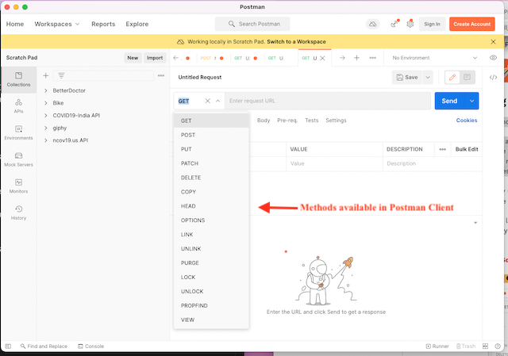
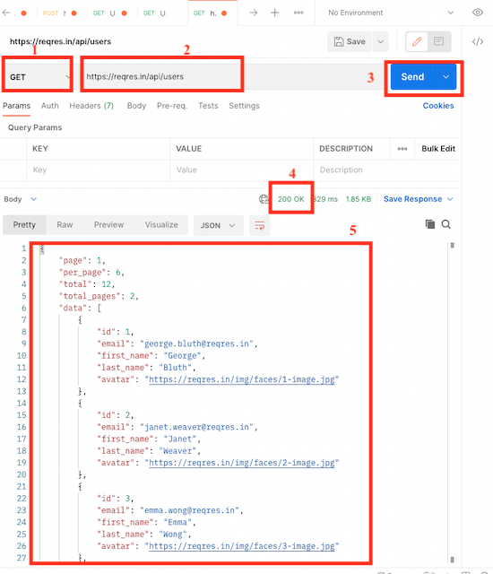
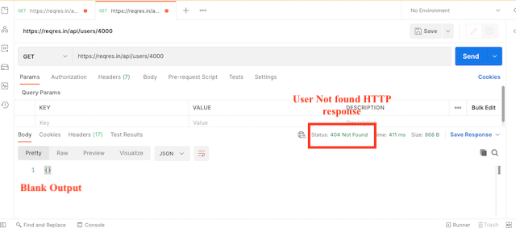
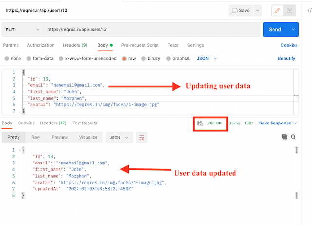

# REST API

### Week 5 Keywords and Questions

- What is an API?
- What is a Restful API?
- What is JSON?

### Prerequisites

Here are links to lessons that should be completed before this lesson:

- [API/JSON Lesson](/api/apis-and-json.md)

### Motivation

As you have seen in the API lesson, working with APIs is the daily bread of any full stack developer. An API opens a developer's code to the world, makes it easy for the world to interact with it. As a full stack developer, it is so rewarding to build your own API for your project. Believe me, it can be very rewarding to learn how to build one.

Moreover, `What's an API?` and `Can you explain to me what is REST?` are two very common interview questions and one of the best ways to answer these questions is by explaining what these are in your own words, and also supplement your explanation with examples.

### Objectives

**Participants will be able to:**

- Acquire knowledge about RESTful APIs
- Build a complete RESTful API

### Specific Things To Learn

[Part I: Lesson](#part-i-lesson)

- [What is an API?](#what-is-an-api)
- [What is REST?](#what-is-rest)
- [HTTP Methods](#http-methods)
- [RESTful Routing](#restful-routing)
- [PUT vs POST](#put-vs-post)

[PART II: Guided Practice](#part-ii-guided-practice)

- [Call REST APIs Using POSTMAN Client](#call-rest-apis-using-postman-client)

[PART III: Reference, Practice and Supplemental Materials](#part-iii-reference-practice-and-supplemental-materials)

- [Examples of real life APIs](#examples-of-real-life-apis)
- [HTTP Status Codes](#http-status-codes)
- [Independent Practice](#independent-practice)
- [Challenge](#challenge)
- [Check for Understanding](#check-for-understanding)
- [Supplemental Materials](#supplemental-materials)

### Materials

- [Roy Fielding on REST in 2000](https://www.ics.uci.edu/~fielding/pubs/dissertation/rest_arch_style.htm)
- [Codecademy article on CRUD](https://www.codecademy.com/articles/what-is-crud)
- [RESTful API website](https://restfulapi.net/rest-put-vs-post/)
- [Mockaroo to generate Mock Data](https://mockaroo.com/)

---

## Part I: Lesson

### What is an API?

As it stands, an API is an acronym for an **A**pplication **P**rogramming **I**nterface. It's a protocol; it's "the interface through which you access someone else’s code, or through which someone else's code accesses yours." ([As previously seen in the APIs & JSON Lesson Slides](https://docs.google.com/presentation/d/1sD3nwQnhbe1wPnAWes0Nbt578tJacTtx0Yqy8XFp7w8/edit?usp=sharing)).

### What is REST?

When we're building an API, there are many choices that can be taken by the developer, and sometimes this can lead to a variety that doesn't necessarily align with a consensus. For that matter, REST was introduced to the DEV community in order to have a unified way to build APIs so their usage could become easier.

Again, REST is an acronym. It stands for **RE**presentational **S**tate **T**ransfer, and was first presented by [Roy Fielding in 2000](https://www.ics.uci.edu/~fielding/pubs/dissertation/rest_arch_style.htm). However, don't worry too much about the definitions or theory of REST, as almost all modern APIs you'll encounter will likely follow its principles to some degree.

Basically, a REST API is simply a style of architecture that we use when we design any type of networked applications. It can be implemented in any language, but for this lesson, we will be using NodeJS.

### HTTP Methods

When you want to make a request to your API, if that one follows RESTful conventions, you will want to use specific HTTP Methods. Here are the most common ones; the ones we will be using below in the guided practice:

| HTTP Method | Description                                        | CRUD mapping |
| ----------- | -------------------------------------------------- | ------------ |
| `GET`       | Fetch data from a collection of resources          | `READ`       |
| `POST`      | Submit data to a collection of resources           | `CREATE`     |
| `PUT`       | Update an entire specific resource in a collection | `UPDATE`     |
| `DELETE`    | Delete a specific resource in a collection         | `DELETE`     |

Please note that the `CRUD` mapping is only there to denote the similarity between the RESTful verbs and the basic operation done on the data repository. In a real-life API, using a real database, the `CRUD` implementation would vary depending on the database type used. For the purpose of this lesson, the functionalities will only be implemented in plain JavaScript. If you are not familiar with `CRUD`, it's perfectly OK as this is a model developers keep in mind when creating APIs. Simply, `CRUD` stands for **C**reate **R**ead **U**pdate and **D**elete. If you want more information about this, here is a [great article on Codecademy](https://www.codecademy.com/articles/what-is-crud).

### RESTful Routing

The core of the RESTful API remains in the URI specification that you will be using, as we use URIs to reach resources. The process is simple. We start with our base uri, for example `/`, and then we add on the resource we want to address.

When building routes, we will use nouns to represent resources. For example:

| Resource                 | Noun       |
| ------------------------ | ---------- |
| Users of the application | `users`    |
| Products                 | `products` |
| Customers accounts       | `accounts` |

So, if we continue with our base url example above, these example resources could be reached as such:

| Resource                 | Noun       | Base URI | RESTful route |
| ------------------------ | ---------- | -------- | ------------- |
| Users of the application | `users`    | `/`      | `/users`      |
| Products                 | `products` | `/`      | `/products`   |
| Customers accounts       | `accounts` | `/`      | `/accounts`   |

When building a more advanced API, with a database that has relations between records, you will still keep the same format, and use a forward slash `/` to separate hierarchical relationships.

For example, with `customers` having a relationship in a database with the `invoices` resource, and these `invoices` have in their turn a relationship with `products`, you could see something like this:

```
/customers
/customers/invoices
/customers/invoices/{id}
/customers/invoices/{id}/products
/customers/invoices/{id}/products/{id}
```

#### PUT vs POST

Sometimes developers experience some difficulty in understanding the difference between PUT and POST. Although there is not really an answer carved in stone, [this nice article](https://restfulapi.net/rest-put-vs-post/) has a neat chart laying out the specific differences between each one, so we invite you to have a look if you want to dig deeper.

I personally keep things simple and use `POST` when I want to deal with an entire collection, either to send new data and create records, and I use `PUT` when I need to handle a single record to edit it. It will come with practice, and by observing [real-life examples](#examples-of-real-life-apis) of well-architectured APIs.

**PUT vs POST examples**

```
GET 	/customers : Get all customers
POST 	/customers : Create a new customer

GET 	/customers/{id} : Get the customer with id `id`.
PUT 	/customers/{id} : Update the customer with id `id`.
DELETE	/customers/{id} : Delete customer with "id"
```

---

## PART II: Guided Practice

### Call REST APIs Using POSTMAN Client

**Postman** is an API platform for building and using APIs. Postman simplifies each step of the API lifecycle and streamlines collaboration so you can create better APIs—faster.

Before working with the testing of API using POSTMAN, install the application from this [link](https://www.postman.com/downloads/).

In POSTMAN, there are many methods but we use only GET, PUT, POST and DELETE



#### Working with GET Requests

**Sends the request and receives the response.**

_Steps to Execute_:

1. Select a `GET` from the dropdown.
2. In the Request Builder, specify the URL of the resource that you want to access. In this example, the URL to access the activity resource is `https://reqres.in/api/users`.
3. Click on `Send` button
4. You will see Status code 200 OK Message
5. There should be 12 user results in the body which indicates that your test has run successfully.



If data is not available against our search, we get blank JSON and 404 status message.



#### Working with POST Requests

**Create a new user or an entity.**

_Steps to Execute:_

1. Select a `POST` from the dropdown.
2. In the Request Builder, specify the URL of the resource that you want to access. In this example, the URL to access the activity resource is `https://reqres.in/api/users`.
3. Click the `Body` tab
4. Select `raw` as the body type.
5. Select `JSON` as the format.

- Pass this payload

  ```json
  {
    "email": "abc.xyz@reqres.in",
    "first_name": "Abc",
    "last_name": "Xyz",
    "avatar": "https://reqres.in/img/faces/1-image.jpg"
  }
  ```

6. Click Send.
7. On successful creation of the activity, Postman returns the response body.


#### Working with PUT Requests

**Updates or creates a new entity.**

_Steps to Execute:_

1. Select a `PUT` from the dropdown.
2. In the Request Builder, specify the URL of the resource that you want to access. In this example, the URL to access the activity resource is `https://reqres.in/api/users/13`.
3. Click the `Body` tab
4. Select `raw` as the body type.
5. Select `JSON` as the format.
   - Pass json payload you want to update
6. Click on `Send` button
7. You will see Status code 200 OK Message and updated user data



#### Working with DELETE Requests

**Deletes the user or entity**

_Steps to Execute:_

1. Select a `DELETE` from the dropdown.
2. In the Request Builder, specify the URL of the resource that you want to access. In this example, the URL to access the activity resource is `https://reqres.in/api/users/13`.
3. Click on `Send` button
4. You will see Status code 204 - No Content, and Deletes user id =13 if available in the system


> Note: You can revisit this section once you have completed [Express JS](../express-js/express.md)

<details>
<summary>Building a simple REST API with NodeJS and Express.</summary>

Now for the good part! Let's code together and build a small RESTful API, which will store and change data which is hard-coded within the project file. This will mimic changes that would normally occur in a database, should the API be used in a real application.

### Planning

The first thing I like to do when building an API is to plan it out. This helps me to consider what routes I will need in terms of resources, nouns, etc.

The API we will build is a simple customer management tool where we have customers and invoices resources.

For our customers, we'll want the full CRUD functionality whereas for the invoices, we only want `CREATE` and `UPDATE` ones.

So, if we follow along our RESTful routing conventions above, our routes will look something like this:

**Customer-Management API**

| Route             | HTTP Method               |
| ----------------- | ------------------------- |
| `/customers`      | `GET` and `POST`          |
| `/customers/{id}` | `GET`, `PUT` and `DELETE` |
| `/invoices`       | `GET` and `POST`          |
| `/invoices/{id}`  | `GET` and `PUT`           |

### Building the API

We will build the RESTful API step by step.

#### Set-up the environment

This lesson assumes that you have NodeJS installed and running on your system.

Open up your favorite code editor and open a new terminal window. Navigate to the folder you wish to put in your project in and create a new directory named `node-customer-management`. Change into the directory and create a new project, filling in the information asked to label the project as you wish.

```bash
mkdir node-customer-management
cd node-customer-management
npm init
```

##### Install some dependencies

Since the focus of this lesson is building a RESTful API, there are a couple of things that we will install to make life easier. In your terminal, install a couple of packages:

```bash
npm install express body-parser
```

`Express` is the main package we will use to build our server and `body-parser` is used to be able to manipulate the `req.body` object without too much headache.

**Note that anytime you make a change in your server file, you will have to restart your server to see the changes being propagated. For this, simply click in the terminal and hit CTRL-C, then start the server again.**

#### Build the server

Create a new file named `server.js` with your favorite code editor and inside, follow these steps:

1. Import the `express` and `body-parser` packages.

```javascript
const express = require('express');
const app = express();
const bodyParser = require('body-parser');
```

2. Set the port variable.

```javascript
const port = process.env.PORT || 3000;
```

3. Create the server, making sure to add the body-parser functions **after** the app has been created.

```javascript
const app = express();
app.use(bodyParser.json());
app.use(bodyParser.urlencoded({ extended: true }));

app.listen(port, () => {
  console.log(`Server running on port ${port}...`);
});
```

4. Test your server by opening up a terminal in the directory your `server.js` file currently is in, then run:

```bash
node server.js
```

If all goes well, you should see your console log appear:

```bash
Server running on port 3000...
```

Your server is ready to receive requests. Express makes things easy for us in that sense, so we can now focus on building the API.

#### Build the API

The process is simple. Each time a request will be made to an endpoint of our API, we want to return the appropriate response that we carefully laid out in our plan.

So, in order to reproduce some kind of data repository, we first need to create 2 JavaScript arrays, each containing objects describing our resources. (The data used in this lesson was generated using [Mockaroo](https://mockaroo.com/))

```javascript
let customers = [
  {
    id: 1,
    first_name: 'Fremont',
    last_name: 'Broader',
    email: 'fbroader0@bloglines.com',
    gender: 'Male',
    ip_address: '23.27.246.1'
  },
  {
    id: 2,
    first_name: 'Georgetta',
    last_name: 'Blamey',
    email: 'gblamey1@wisc.edu',
    gender: 'Female',
    ip_address: '17.110.6.159'
  },
  {
    id: 3,
    first_name: 'Meghann',
    last_name: 'Quillinane',
    email: 'mquillinane2@surveymonkey.com',
    gender: 'Female',
    ip_address: '237.88.226.148'
  },
  {
    id: 4,
    first_name: 'Kerby',
    last_name: 'Mate',
    email: 'kmate3@si.edu',
    gender: 'Male',
    ip_address: '81.44.87.187'
  },
  {
    id: 5,
    first_name: 'Loren',
    last_name: 'Brabon',
    email: 'lbrabon4@umich.edu',
    gender: 'Female',
    ip_address: '47.137.187.14'
  }
];

let invoices = [
  {
    id: 6,
    product: 'Island Oasis - Ice Cream Mix',
    price: '$0.78',
    currency: 'BRL',
    quantity: 17,
    type: 'Restaurants'
  },
  {
    id: 7,
    product: 'Ice Cream - Turtles Stick Bar',
    price: '$9.23',
    currency: 'EUR',
    quantity: 9,
    type: 'Marine Transportation'
  },
  {
    id: 8,
    product: 'Shrimp - Black Tiger 8 - 12',
    price: '$2.50',
    currency: 'COP',
    quantity: 20,
    type: 'Computer Communications Equipment'
  },
  {
    id: 9,
    product: 'Wine - Blue Nun Qualitatswein',
    price: '$8.52',
    currency: 'IDR',
    quantity: 64,
    type: 'Packaged Foods'
  },
  {
    id: 10,
    product: 'Truffle Shells - White Chocolate',
    price: '$7.51',
    currency: 'EUR',
    quantity: 65,
    type: 'Industrial Specialties'
  }
];
```

Once this is done, we will create our first route. Remember our planning? This is the route we want to create:

| Route        | HTTP Method |
| ------------ | ----------- |
| `/customers` | `GET`       |

With Express, routing is as easy as chaining the HTTP method to the `route()` method, taking care of passing the the route you want to lookup as a parameter:

```javascript
app.route('/customers').get((req, res) => {
  res.status(200).send(customers);
});
```

Now kill the server by pressing `Ctrl`+`C` and restart the server by running `node server.js`.

Now if you test your route with Postman or by opening a browser and going to `http://localhost:3000/customers`, you should see:

```json
[
  {
    "id": 1,
    "first_name": "Fremont",
    "last_name": "Broader",
    "email": "fbroader0@bloglines.com",
    "gender": "Male",
    "ip_address": "23.27.246.1"
  },
  {
    "id": 2,
    "first_name": "Georgetta",
    "last_name": "Blamey",
    "email": "gblamey1@wisc.edu",
    "gender": "Female",
    "ip_address": "17.110.6.159"
  },
  {
    "id": 3,
    "first_name": "Meghann",
    "last_name": "Quillinane",
    "email": "mquillinane2@surveymonkey.com",
    "gender": "Female",
    "ip_address": "237.88.226.148"
  },
  {
    "id": 4,
    "first_name": "Kerby",
    "last_name": "Mate",
    "email": "kmate3@si.edu",
    "gender": "Male",
    "ip_address": "81.44.87.187"
  },
  {
    "id": 5,
    "first_name": "Loren",
    "last_name": "Brabon",
    "email": "lbrabon4@umich.edu",
    "gender": "Female",
    "ip_address": "47.137.187.14"
  }
]
```

So, the same way, you can setup the second GET method, as planned:

| Route       | HTTP Method |
| ----------- | ----------- |
| `/invoices` | `GET`       |

With Express, routing is as easy as chaining the HTTP method to the `route()` method, taking care of putting the route you want to lookup inside of the `route()` method parenthesis.

```javascript
app.route('/invoices').get((req, res) => {
  res.status(200).send(invoices);
});
```

This time, if you test, you will get the entire invoices collection.

However, the beauty of a RESTful API is that we want to use the possibility to fetch a particular customer or invoice. To do so, we need to create another set of routing that includes the ID of the record we wish to inquire about. For example, if we look at our data, we know that there is a customer with id 1 and an invoice with id 6. If we go back to our plan, we can see that we already had planned the route for these:

| Route             | HTTP Method |
| ----------------- | ----------- |
| `/customers/{id}` | `GET`       |
| `/invoices/{id}`  | `GET`       |

So, to create these, simply add another routing to the `app`, but this time we need to fetch the ID that's included in the parameters. If you recall your server lessons, this can be done by accessing the `req.params` object. We then should iterate through all records until we find the record that has the same `id` because that is the property that we are looking for. Of course, you could use any of the object's properties, here. You would just need to adjust the route appropriately, but we will not cover this for now.

```javascript
app.route('/customers/:id').get((req, res) => {
  let customer_id = req.params.id;
  let status = 400;
  let response = 'Unable to fetch data!';
  customers.forEach((customer) => {
    if (customer['id'] == customer_id) {
      res.status(200).send(customer);
    }
  });
  res.status(status).send(response);
});

app.route('/invoices/:id').get((req, res) => {
  let invoice_id = req.params.id;
  let status = 400;
  let response = 'Unable to fetch data!';
  invoices.forEach((invoice) => {
    if (invoice['id'] == invoice_id) {
      res.status(200).send(invoice);
    }
  });
  res.status(status).send(response);
});
```

If you test your routes with Postman or by opening a browser and going to `http://localhost:3000/customers/1` and to `http://localhost:3000/invoices/6`, you should see these 2 records being returned.

Now, in order to have a full-out API, we need more routes. So, we will now create the remaining routes, mainly the `POST`, `PUT` and `DELETE` ones.

Please note that the logic for `PUT` and `DELETE` is incomplete and won't actually do what it should. The goal of this exercise is for you to understand how to set up routes so don't worry too much about the logic yet, we will get to that in future lessons.

First, let's take care of the `POST` routes, like planned:

| Route        | HTTP Method      |
| ------------ | ---------------- |
| `/customers` | `GET` and `POST` |
| `/invoices`  | `GET` and `POST` |

For that, you can simply chain the `.post()` Express method after the `.get()` one:

```javascript
  // POST in the /customers route
  .post((req, res) => {
    /*
    * We are assuming here that an entire customer object is sent through the body
    * For a more robust API, you should implement a check here
    */
    let newCustomer = req.body;
    customers.push(newCustomer);
    /*
    * Here, we choose to return the customer object, but you could respond with anything such as a
    * generic message, etc.
    * When testing, you could console.log the complete customers array to see the added customer.
    */
    res.status(200).send(newCustomer);
  })

  // POST in the /invoices route
  .post((req, res) => {
    let newInvoice = req.body;
    invoices.push(newInvoice);
    res.status(200).send(invoices);
  })
```

If we look at what's left in our plan, we are just missing the `PUT`, and the `DELETE` methods:

| Route             | HTTP Method        |
| ----------------- | ------------------ |
| `/customers/{id}` | `PUT` and `DELETE` |
| `/invoices/{id}`  | `PUT`              |

Although this seems like a lot, in reality, they are quite easy to implement.

```javascript
  // PUT in the /customers/:id route
  .put((req, res) => {
    let customer_id = req.params.id;
    let status = 400;
    let response = "Unable to fetch data!";
        let propertiesToChange = req.body;
    let updatedCustomer = {};
    customers.forEach((customer) => {
              updatedCustomer = {
          ...customer,
          ...propertiesToChange
        }
    })
    status = 200;
    response = updatedCustomer;
    res.status(status).send(response);
  })

  // PUT in the /invoices/:id route
  .put((req, res) => {
    let invoice_id = req.params.id;
    let status = 400;
    let response = "Unable to fetch data!";
        let newInvoice = {}
    invoices.forEach((invoice) => {
              newInvoice = req.body;
    })
    status = 200;
    response = newInvoice;
    res.status(status).send(response);
  })
```

Finally, for the `DELETE` method:

```javascript
  // DELETE only in the /customers/:id route
  .delete((req, res) => {
    let customer_id = req.params.id;
    let status = 400;
    let response = "Unable to fetch data!";
    let newCustomers = customers.filter((customer) => {
              return customer;
    })
    status = 200;
    response = newCustomers;
    res.status(status).send(response);
  })

```

And there you go! You now have a complete functioning RESTful API with full CRUD functionality!

 </details>

## PART III: Reference, Practice and Supplemental Materials

### Examples of real life APIs

To further help you in building your own understanding of API architectures, it is highly recommended to look at already published APIs, dive into their documentation, and learn from the bests. There are many ways to craft an API and every developer or team will make things a little bit different to suit their operational needs.

- Here is a great list of [public APIs](https://github.com/public-apis/public-apis), most of which have great documentation. Also, they could be a starting point for you to test your front end abilities by using them, and they can also inspire you to build an awesome API yourself!

- If you want to dig deeper in API building, this [collaborative list of great resource](https://github.com/marmelab/awesome-rest#nodejs-clients) is full of gems and tools for automation, for example the [Restify](https://github.com/restify/node-restify) framework or [rest-hapi](https://github.com/JKHeadley/rest-hapi), a RESTful API generator.

### HTTP Status Codes

Since it is important to use the common status codes to build your response when crafting your API, here are, for your reference, the most common server responses:

| code | status                                    |
| ---- | ----------------------------------------- |
| 1XX  | Informational                             |
| 2XX  | Success                                   |
| 200  | OK                                        |
| 201  | OK created                                |
| 204  | No content, but the headers may be useful |
| 3XX  | Redirection                               |
| 301  | Moved permanently                         |
| 302  | Found                                     |
| 304  | Not Modified (Cached Version)             |
| 4XX  | Client Error                              |
| 400  | Bad Request                               |
| 401  | Unauthorized                              |
| 404  | Not Found                                 |
| 5XX  | Server Error                              |
| 500  | Internal server error                     |

_For a more comprehensive list, please refer to the [official MDN docs](https://developer.mozilla.org/en-US/docs/Web/HTTP/Status)_

### Independent Practice

Because practice makes perfect, especially with REST APIs, work with you pair on the following exercise:

- The [Mailing List REST API with Express activity](/projects/mailing-list-rest-api.md).

### Challenge

- Can you find of a better way to clean the code? Could it be by splitting the code so you separate all the server logic and the Express app one in different files? Why do you think this could be a good practice? Try to implement a solution.

- Even if this is only an example solution, could you think of a cleaner way to bring about the `customers` and `invoices` data and prevent cluttering the server file?

- How would you go about implementing checks to make sure the `PUT` methods are not simply replacing parts or the entirety of a resource with an empty property or an empty object?

### Check for Understanding

- Make a cheatsheet of the `REST` verbs you have learnt in this lesson, with their significance.
- Build a route generator where you only need to input the resource name and it produces RESTful routes for you.
- Build a collection to test your routes in Postman.

### Supplemental Materials

- If you want to follow along another type of guided practice, you can have a look at how to [Build a Node.js API in Under 30 Minutes](https://www.freecodecamp.org/news/building-a-simple-node-js-api-in-under-30-minutes-a07ea9e390d2/) blog post.
- [5 Minute Intro to REST APIs](https://www.newline.co/@bchiang7/5-minute-intro-to-rest-apis--b5081674)
- Another great resource is the [What is a RESTful API](https://www.youtube.com/watch?v=Q-BpqyOT3a8) video tutorial by Traversy Media.
- To learn about the Guiding principles of REST:
  - [restfulapi.net](https://restfulapi.net/rest-architectural-constraints/)
  - [Wikipidia](https://en.wikipedia.org/wiki/Representational_state_transfer#cite_note-Fielding-Ch5-3)
  - [Dinesh on Java](https://www.dineshonjava.com/what-is-rest-and-rest-architecture-and-rest-constraints/), to show you APIs can be built with any language but keep their familiarity.
  - [Future Vision on Medium](https://medium.com/future-vision/what-are-the-constraints-of-rest-and-how-they-saved-the-internet-6fb8503138ab)
