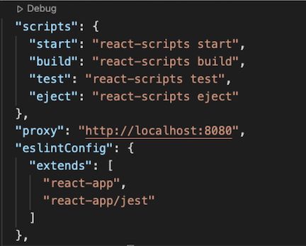
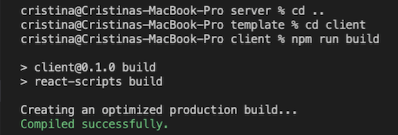
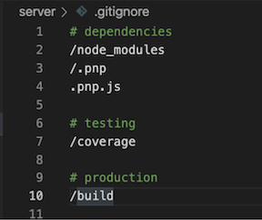
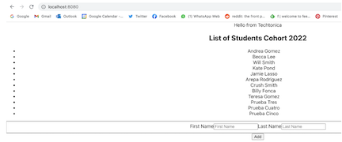
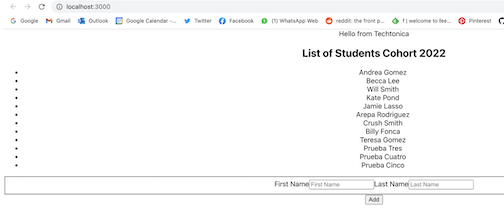

# Preparing Your Local Project To Be Production Ready For Deployment

### Prerequisites
- [JS Lessons I - VI](../javascript)
- [Node Lesson](../node-js/node-js.md)
- [Express Lesson](../express-js/express.md)
- [PostgreSQL Lesson](../databases/installing-postgresql.md)
- [Node.js and npm must be installed](https://nodejs.org/en/download/)
- An existing Express/Node.js app

### Learning Objectives
**Participants will be able to:**

- Understand the difference between setting up a local and production environment
- Understand the difference between production and deployment
- Build a production environment for their local project

### Local vs Production vs Deployment

**Local Environment**: This is a coding workspace on the developer's computer. Since it is connected to the developer's local drive, this environment is meant for development and testing, not for deployment. Instead, a production environment is needed for live deployment.

**Production Environment**: This is the environment where your application is fully live and accessible to users on the web. Setting up the production environment allows you to deploy your code into a real-world setting.

**Deployment**: This is the entire process of moving your code from development to its final destination, production. It can involve steps like copying files, setting up your server, and making the application available to users.

## Build Your Production Instructions

These instructions will help you to have a production environment different from your local dev. This will help you to have a place to show your last working code while having a different space to keep working on improving your project. 

**Note**: These instructions assume you are using the [provided project template](https://github.com/Techtonica/curriculum/blob/main/projects/2023TemplateWithVite/README.md). If you are not, some steps or configurations might differ.

### Things to modify in your CLIENT folder

1. Add your local server as a proxy in the package. json file in the CLIENT side. This will help you to run all your files on one server and will tell that server which port to use when is doing any fetch call. You should see something like this:

**Note**: You may be using a different PORT, for example: "http://localhost:3000"

2. This proxy will tell the server what port to use, so you NOW can safely delete all references to your localhost in your CLIENT React files.

3. Once you update all your fetch calls to localhost you can successfully create your build production package. Go to your terminal to the CLIENT folder and run the command npm run build. You will see a message like this: (this could take a while!)

4. Once that process is finished, if you do ls in your client folder you will see a build folder. That folder contains your production code. 

5. Make sure that you include that build folder in your .gitignore. You don’t want your production code on Github 

### Things to modify in your SERVER folder

Several things need to change in your server.js file in order to tell your server that now you have a production code separate from your dev environment

1. Include Path at the top of your file:

2. Create the route for the Build directory using path and tell the express app that you’re using that path 

3. Add the process.env.PORT option to your port variable

**Note**: You may be using a different PORT

4. Change the endpoint “/” to render index.html as the start point of your application (this index.html will come from your Build folder)

### How to test these changes?

1. At this point, if you go to your server folder and run npm start you will see your whole application running in your localhost. This will be your production server and code! (This is the localhost on your server.js file)

2. If you go to a different terminal and go to your client folder and run npm start you will still see your code running. This is still your dev environment. This is still the local host of React, which is 3000 by default

At this point, if you do any change in your code on React, you will see it immediately in your port 3000. If you want to see it on production, you need to kill the server process and run npm run build again. 