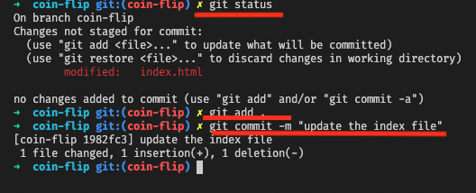
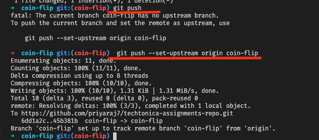
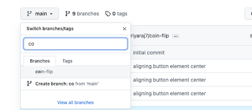
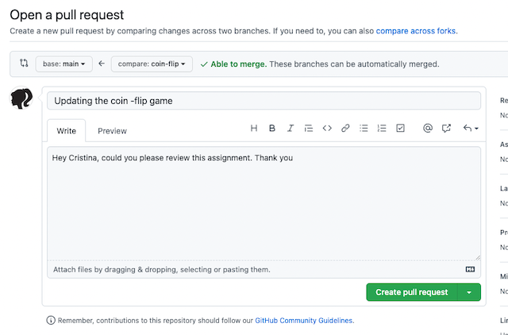
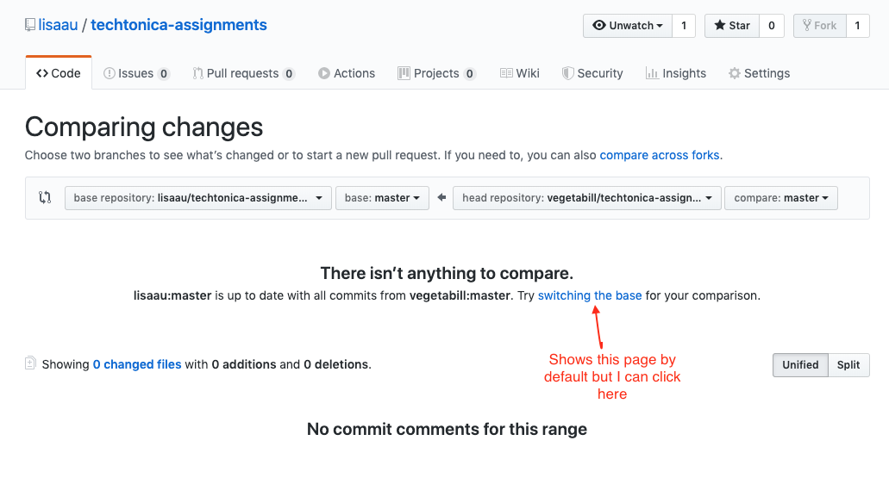
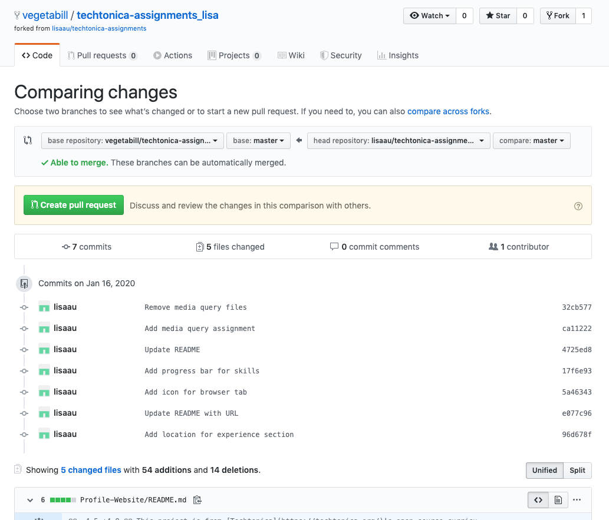

# How to Submit Work

These instructions only apply to in-person learners. Open source readers can skip this file.

## Prerequisites

- [Git Version Control](/git/git-version-control.md)
- [GitHub Collaboration](/git/github-collaboration.md)

These instructions apply to anything that you need to submit to the SEAM for review. If unsure if you need to submit something, ask the STEM.

## Pull Request

### Pull Request of your own project you started from scratch

First, open terminal. Go into or `cd` into the techtonica assignment repo. In this example repository is called `techtonica-assignments-repo`.

I assume you are in a git repos working tree. You can check using the following command, which will print `true` if you are in a git repos working tree

```bash
git rev-parse --is-inside-work-tree
```

Next, `cd` into the folder you want to do the PR. In this example directory is called coin-flip


Lets create the branch on your local machine and switch in this branch

```bash
git checkout -b [name_of_your_new_branch]
```


Double-check you are in the new branch. Make any changes/edit within the code just so we have a change to commit in the PR. Let's `Save` the files and get ready to make PR.

Check the status of all the files we changed.

```bash
git status
```

Add the files to get pushed into the PR using the command `git add .` or `git add <filename>`

Now files are added, let's go ahead and commit it

```bash
git commit -m "commit message"
```



Lastly push all your work to the GitHub repo

```bash
git push --set-upstream origin <branch-name>
```



#### Creating the Pull Request

- Go to your repository on GitHub
- In the "Branch" menu, choose the branch that contains your commits.
  
- Above the list of files, click Pull request. Then click `New pull Request`
  

- Use the base branch dropdown menu to select the branch you'd like to merge your changes into, then use the compare branch drop-down menu to choose the topic branch you made your changes in. Click `Create pull request`

  

- Type a title and description for your pull request. Click `Create pull request`

  

- At last copy the URL and send it to the reviewer

  

### Differences between forks


These are your commits since last merged PR.

When you click "New Pull Request" you'll see this page.



There will be a small hint about which "base" to use.



Verify the changes are what you'd like to have reviewed. If it is too many changes you'll need to create a branch with _only_ the changes you want to be reviewed. When in doubt, smaller PR's are easier to review and merge.

### Naming

The default name of the PR is the last commit message. Instead, please make it the name of the assignment used, e.g.

> HTML/JS Game Project - Boggle

### General Suggestions

- Read any PR comments and try to address the feedback promptly. It's harder to remember the code if more time has elapsed.
- If the feedback is confusing, ask for clarification or for your pair to read it and see if they understand
- Keep the STEM's fork up to date so you're not opening a huge PR or multiple PR's in one week
- Volunteers may review the PR's and so they may not know as much context. Try to be understanding if they misinterpet what we're doing

### FAQ

#### I prefer to create a new repo per project

- That's entirely up to you
- For the purposes of submitting for review, the SEAM will only review PR's in their fork of your Assignments repo
- Get your separate repo is in a state where you want to review
- Copy the folder of your repo (using regular `cp`) to your assignments repo. For simplicity, naming the destination folder as the same of your repo might help keep things simple
  - consider adding `-snapshot` to the end of the name to help remind you it's just a copy of another repo and won't stay in sync
- Commit and push those changes to your assignments repo
- Open a PR to the STEM's fork as above
